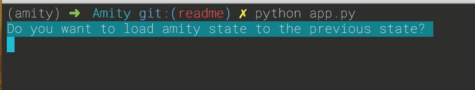
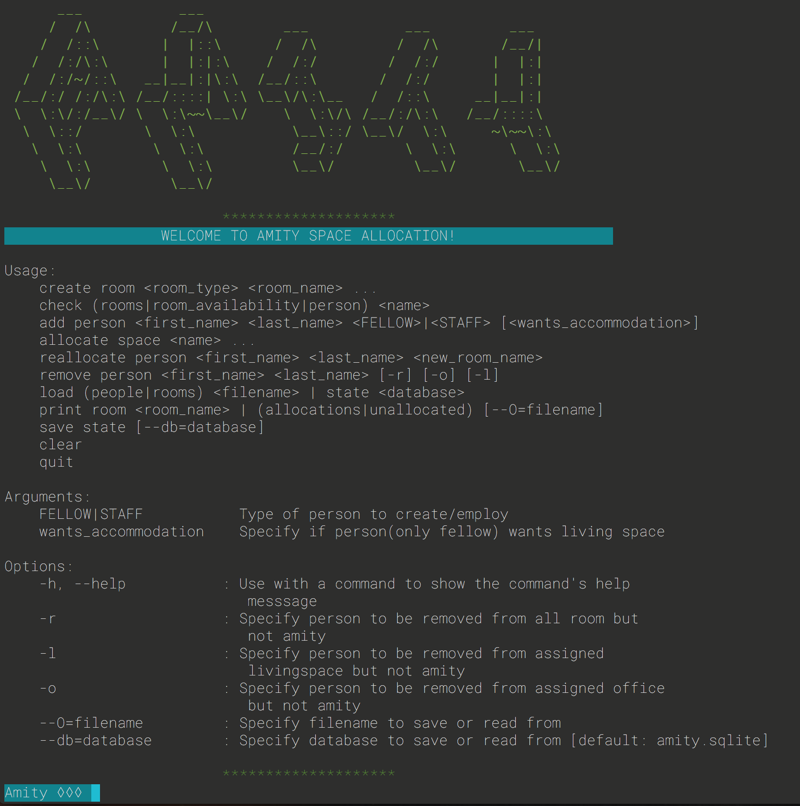
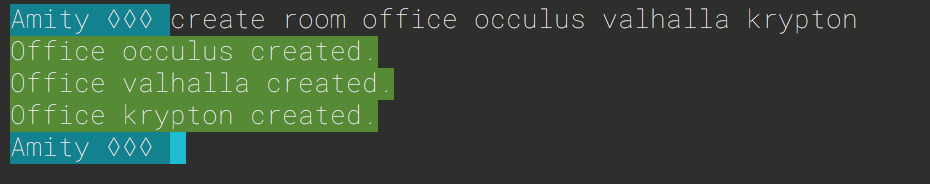
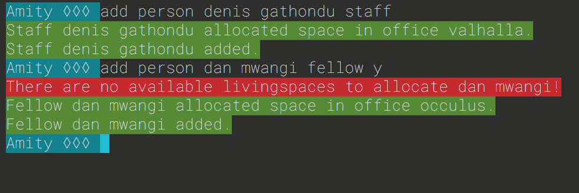

# AMITY
[](https://www.codacy.com/app/Gathondu/Amity?utm_source=github.com&amp;utm_medium=referral&amp;utm_content=Gathondu/Amity&amp;utm_campaign=Badge_Grade)
[](https://circleci.com/gh/Gathondu/Amity/tree/develop)

This is a room allocation system that randomly allocates rooms to people.
A room in amity can either be an `office` or a `livingspace`. Offices in amity can only accommodate 6 people whereas a livingspaces can only accommodate 4.

A person in amity can either be a `staff` or a `fellow`. Staff can only be assigned offices but not livingspaces whereas fellows can be assigned either or both, depending on if they want a livingspace.

## Getting Started

These instructions will get you a copy of the project up and running on your local machine for development and testing purposes.

This application has been tested and run using `python 3 ` and you can download it from their official page [here](https://python.org/downloads/).

I did all my development from a virtual environment and this [documentation](http://docs.python-guide.org/en/latest/dev/virtualenvs/)
gives a detailed methodology to create and use a virtual environment.

### Prerequisites

Together with the documentation of the application I have included a [requirements.txt](requirements.txt) file
which has a list of the modules that the application depends on to run.

To install the dependencies listed, run the following code: `pip install -r requirements.txt`.

### Installing

Create a virtual environment called `amity`. 

Find the instructions for installing and using a virtual environment and virtualenv wrapper [here](http://docs.python-guide.org/en/latest/dev/virtualenvs/).

Run the environment using `workon amity` and clone my application by running the following command on your terminal:

   `git clone https://github.com/Gathondu/Amity.git`

### Running Amity 

After cloning enter the application folder using the following command `cd Amity`.

From your terminal you can now run the application by using the following command: 

```
python app.py
```

you will be asked if you want to load the previous saved test as follows:

   

then depending on your choice, yes or no, a welcome screen will show as follows: 

   

You can now interact with amity by running the commands displayed in the documented usage.

### Examples:
+ To create a room which is an office run the command `create room office occulus` or use `livingspace` if you want to create a livingspace. You could also give a list of room names to create by separating the names with spaces as shown:

    

+ To add a person, use the command `add person denis gathondu staff` and for a fellow who wants a living space use `add person dan mwangi fellow y`. 

    

    *NOTE:* the livingspace option only applies to fellows and not staff. Also, no two people can share identical both names, but *denis gathondu* is considered to be different from *gathondu denis* but this is not advised.

+ You can reallocate a person using the command `reallocate person <name>` but if the person has no allocations then you must first allocate them using the `allocate space <name>` command.

+ You can remove a person from an office, livingspace , both or entirely from amity by running the `remove` command with the desired option.

+ You can load people or rooms from a file by using the `load` command. This command also allows you load a saved state from the database

+ You can save the state by using the `save state` command

+ You can also print out the allocated people and the un-allocated using the `print` command and specifying the filename saves the allocations on the specified file. This command can also be used to print the occupants of a room by stating the room name `print room <room name>`

+ You could clear the screen if you wish by using the `clear` command.

+ To quit the application run the `quit` command an this will prompt you if you are sure and if yes, it will prompt you if you would like to save that state.

## Running the tests

To run the test for the application, type in the following command `pytest` on the terminal pointing to the applications folder. This will run the test in quiet mode.

To run the test in a more descriptive, verbose output, run the following command: `pytest -v`.

The tests coverage can also be view by typing `pytest --cov=model` on the terminal pointing to the applications folder. This will display the coverage and the percentages on the terminal.

You can view this information in a more visual way by running the command: `pytest --cov-report html --cov=model`. A new folder named `htmlcov` will be created. Go to your computer file viewer and open the new folder created. Click on the `index.html` file inside the folder. This will display a more appealing test coverage for the project on your browser.

## Built With

   * [Visual Studio Code](https://code.visualstudio.com/) for Mac Os
   * [Python 3.5.2](https://python.org/downloads/)


## Resources

   * [Andela](https://andela.com/), top 1% talent.
   * [pluralsight.](https://app.pluralsight.com)
   * [Stack Overflow.](https://stackoverflow.com/)
